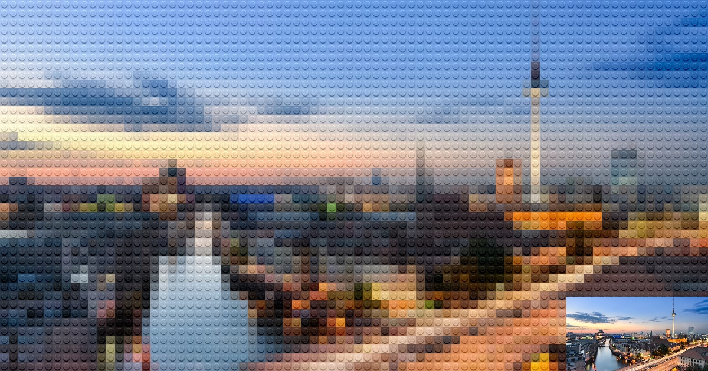
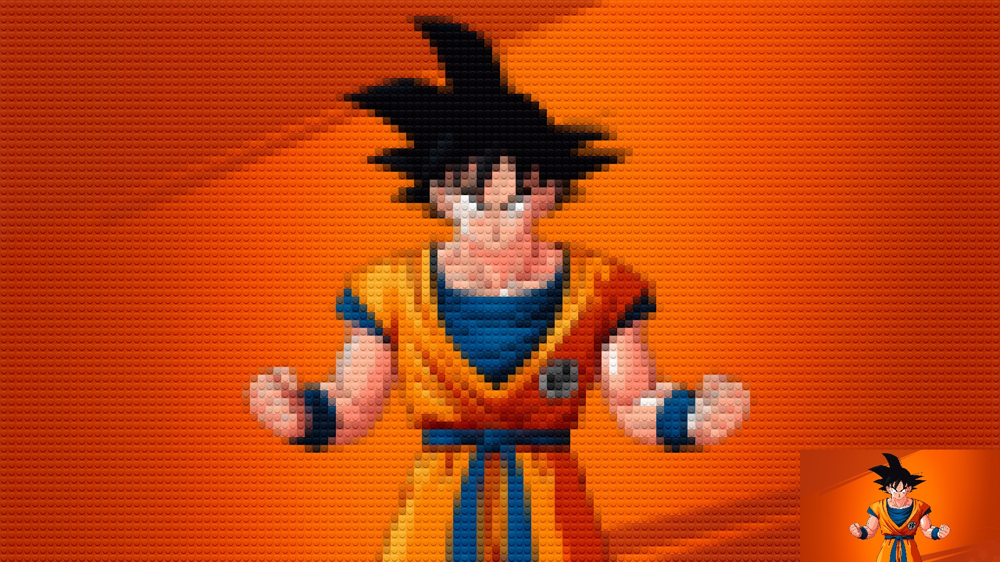
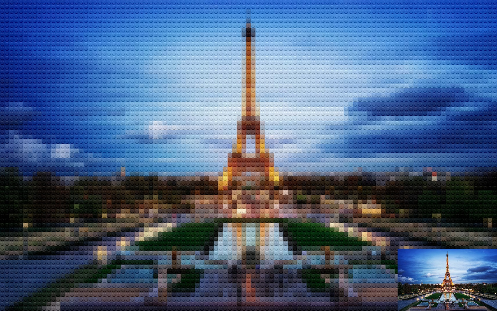
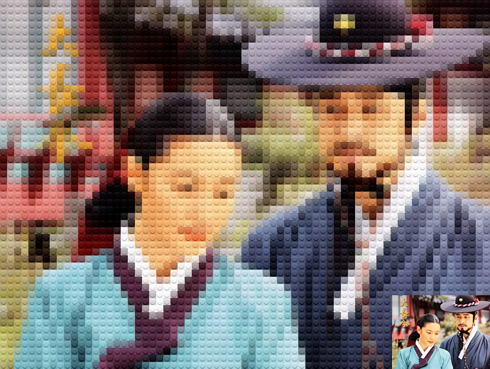
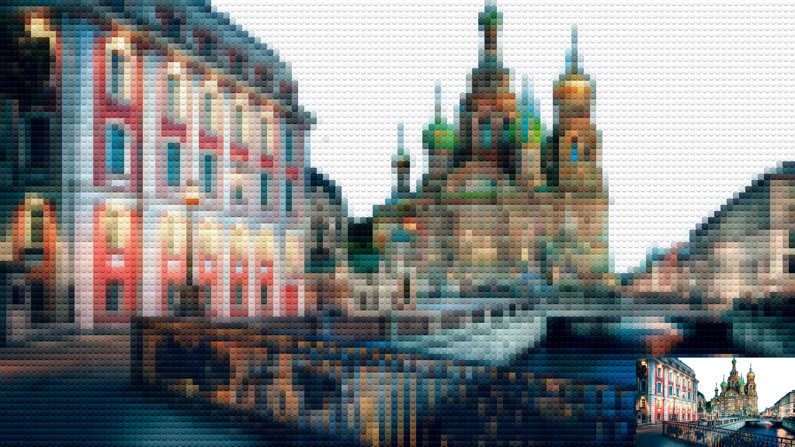
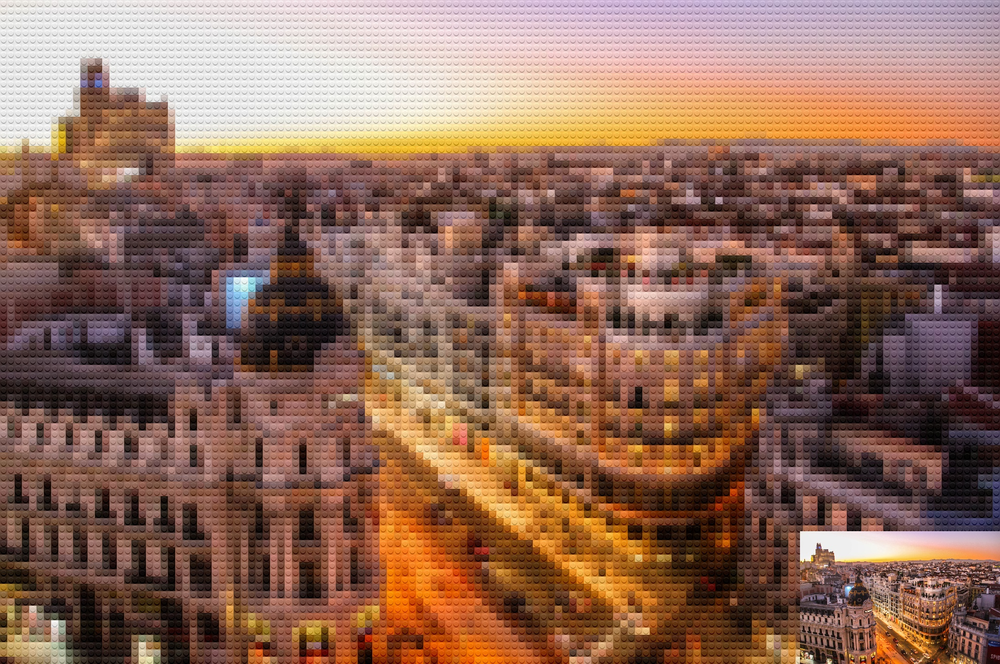

# [PYTHON] Lego generator

**New Idea**: Duplicate the lego piece and directly add it to the image, it will remove all the ugly part in spliting the image into piece like the original impl. I'll try it tomorrow

## Introduction

Here is my python source code for Lego generator. To the best of my knowledge, my code is the shortest one you could find out for this goal. With my code, you could: 

* **Given input image, you could generate Lego art stored under image formats (.png, .jpg, ...)**
* **Given input video, you could generate Lego art stored under video formats (.avi, .mp4, ...)**

## Video to video
By running the sript **video2video.py**, we will have following output:

   
  <i>Output video</i>

## Image to image
By running the sript **image2image.py**, we will have following outputs:

   
   
   
   
   
   
   
   
  <i>Output images</i>

## Requirements

* **python 3.6**
* **cv2** 
* **numpy**
